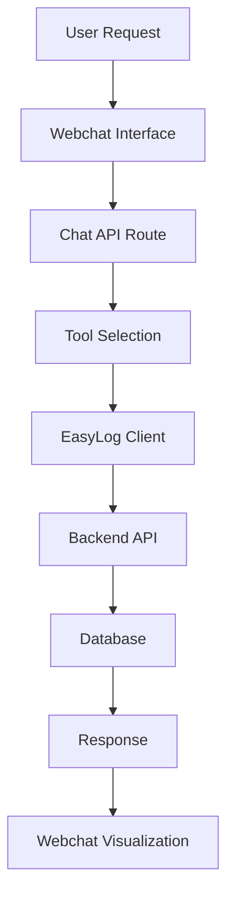

# EasyLog Planning API - Complete Tool Reference

## 📋 Overzicht

Deze documentatie beschrijft alle beschikbare planning API tools in het EasyLog systeem. De tools ondersteunen een hiërarchische planningsstructuur: **Project** → **Phase** → **Allocation** → **Resource**.

> **⚠️ Belangrijk**: De daadwerkelijke API implementatie bevat meer tools dan gedocumenteerd in de JSON agent configuraties. Deze documentatie toont de **werkelijke** beschikbare functionaliteit.

## 🏗️ Planning Hiërarchie

```
Project (hoogste niveau)
├── Phase (onderdeel van project)
│   ├── Allocation (resource toewijzing aan fase)
│   └── Resource (persoon, materiaal, voertuig)
└── Resource Groups (groeperingen van resources)
```

## 📋 **Complete Tool Lijst - Quick Reference**

### 🎯 **Planning Management Tools**

#### **Project Tools**
- `getPlanningProjects(startDate?, endDate?)` - Alle planning projecten ophalen
- `getPlanningProject(projectId)` - Specifiek project met details
- `updatePlanningProject(projectId, name?, color?, ...)` - Project eigenschappen wijzigen

#### **Phase Tools**  
- `getPlanningPhases(projectId)` - Alle fasen van een project
- `getPlanningPhase(phaseId)` - Specifieke fase details
- `createPlanningPhase(projectId, slug, start, end)` - Nieuwe fase aanmaken
- `updatePlanningPhase(phaseId, start, end)` - Fase datums wijzigen

#### **Resource Tools**
- `getResources()` - Alle beschikbare resources
- `getProjectsOfResource(resourceId, datasourceSlug)` - Projecten van resource
- `getResourceGroups(resourceId, resourceSlug)` - Resource groepen

#### **Allocation Tools**
- `createMultipleAllocations(projectId, group, resources[])` - Resources toewijzen
- `deleteAllocation(allocationId)` - ✅ **Bestaat wel** (niet in JSON gedocumenteerd)

### 🗂️ **Data & Knowledge Tools**

#### **Datasource Access**
- `getDatasources(types[])` - Alle databronnen ophalen (ook als `getDataSources`)

#### **Database Access**
- `executeSql(query)` - Directe SQL queries uitvoeren

#### **Document Search**
- `searchKnowledgeBase(userSearchQuery)` - Zoeken in knowledge base
- `loadDocument(documentId)` - Specifiek document laden

### 📊 **Visualization Tools**
- Chart creation tool (geïntegreerd in chat API)
- Ondersteunt: Bar charts, Line charts, Pie charts, Stacked bar charts

### ❌ **Ontbrekende Tools** (API beschikbaar, tool wrapper ontbreekt)

#### **Project/Phase Deletion**
- `deletePlanningProject(projectId)` - API: `v2DatasourcesProjectsProjectIdDelete`
- `deletePlanningPhase(phaseId)` - API: `v2DatasourcesPhasesPhaseIdDelete`

#### **Datasource Details**
- `getDatasource(datasourceId)` - API: `v2DatasourcesDatasourceIdGet`
- `getDatasourceEntry(datasourceId, entryId)` - API: `v2DatasourcesDatasourceIdEntriesEntryIdGet`

#### **Configuration Access**
- `getConfiguration()` - API: `v2ConfigurationGet`
- `getClientConfiguration(clientId)` - API: `v2DatasourcesClientClientIdConfigurationGet`

### 📊 **Tool Availability Matrix**

| Agent Type | Planning | Database | Knowledge | Charts | Deletion |
|------------|----------|----------|-----------|--------|----------|
| **Webchat Agent** | ✅ | ✅ | ✅ | ✅ | ⚠️ Gedeeltelijk |
| **MUMC Agent** | ❌ | ❌ | ✅ | ✅ | ❌ |
| **Debug Agent** | ✅ | ✅ | ✅ | ✅ | ⚠️ Gedeeltelijk |

### 🎯 **CRUD Operations Matrix**

| Category | Create | Read | Update | Delete |
|----------|--------|------|--------|--------|
| **Projects** | ❌ | ✅ | ✅ | ❌* |
| **Phases** | ✅ | ✅ | ✅ | ❌* |
| **Allocations** | ✅ | ✅ | ❌ | ✅ |
| **Resources** | ❌ | ✅ | ❌ | ❌ |

*API ondersteunt delete, tool wrapper ontbreekt

---

## 🛠️ Gedetailleerde Tool Beschrijvingen

### 🗂️ **General & Data Source Tools**

#### `getDatasources(types: string[])`
**Beschrijving**: Haalt alle databronnen op uit EasyLog  
**Parameters**:
- `types`: Array van databron types (lege array `[]` voor alle databronnen)  
**Returns**: JSON lijst van beschikbare databronnen  
**Gebruik**: Voor algemene informatie over beschikbare databronnen

---

### 📋 **Project Management Tools**

#### `getPlanningProjects(startDate?, endDate?)`
**Beschrijving**: Haalt alle planningsprojecten op binnen een datumbereik  
**Parameters**:
- `startDate`: Optionale startdatum in YYYY-MM-DD formaat
- `endDate`: Optionale einddatum in YYYY-MM-DD formaat  
**Returns**: JSON array van projecten met basic informatie  
**Gebruik**: Voor overzichten en project selectie

**Voorbeeld**:
```javascript
getPlanningProjects("2024-01-01", "2024-12-31")
```

#### `getPlanningProject(projectId: number)`
**Beschrijving**: Gedetailleerde informatie over een specifiek project  
**Parameters**:
- `projectId`: Unieke ID van het project  
**Returns**: Volledig project object inclusief fasen en allocaties  
**Gebruik**: Voor diepgaand inzicht in projectstructuur

#### `updatePlanningProject(projectId, name, color, reportVisible, excludeInWorkdays, start, end, extraData?)`
**Beschrijving**: Wijzigt eigenschappen van een bestaand project  
**Parameters**:
- `projectId`: ID van het project om te wijzigen
- `name`: Nieuwe naam voor het project
- `color`: Nieuwe kleurcode voor het project  
- `reportVisible`: Boolean voor rapport zichtbaarheid
- `excludeInWorkdays`: Boolean om project uit te sluiten van werkdag berekeningen
- `start`: Nieuwe startdatum in YYYY-MM-DD formaat
- `end`: Nieuwe einddatum in YYYY-MM-DD formaat
- `extraData`: Optionele extra data als object  
**Returns**: Bijgewerkt project object  
**Gebruik**: Voor project-brede wijzigingen

**Voorbeeld**:
```javascript
updatePlanningProject(123, "Nieuw Project Naam", "#FF0000", true, false, "2024-01-01", "2024-06-30", {"priority": "high"})
```

---

### 📅 **Phase Management Tools**

#### `getPlanningPhases(projectId: number)`
**Beschrijving**: Haalt alle fasen van een specifiek project op  
**Parameters**:
- `projectId`: ID van het project  
**Returns**: Array van fasen binnen het project  
**Gebruik**: Voor overzicht van fasen binnen een project

#### `getPlanningPhase(phaseId: number)`
**Beschrijving**: Gedetailleerde informatie over een specifieke fase  
**Parameters**:
- `phaseId`: Unieke ID van de fase  
**Returns**: Volledig fase object met details  
**Gebruik**: Voor specifieke fase informatie en voor updates

#### `createPlanningPhase(projectId, slug, start, end)`
**Beschrijving**: Maakt een nieuwe planningsfase aan voor een project  
**Parameters**:
- `projectId`: ID van het project om een fase aan toe te voegen
- `slug`: Identifier voor de fase (bijv. "design", "development", "testing")
- `start`: Startdatum voor de fase (flexibele datum formaten)
- `end`: Einddatum voor de fase (flexibele datum formaten)  
**Returns**: Nieuw aangemaakte fase object  
**Gebruik**: Voor het toevoegen van nieuwe stappen of mijlpalen

**Voorbeeld**:
```javascript
createPlanningPhase(123, "qa-testing", "2024-09-01", "2024-09-30")
```

#### `updatePlanningPhase(phaseId, start, end)`
**Beschrijving**: Wijzigt het datumbereik van een bestaande fase  
**Parameters**:
- `phaseId`: ID van de fase om te wijzigen
- `start`: Nieuwe startdatum (flexibele datum formaten)
- `end`: Nieuwe einddatum (flexibele datum formaten)  
**Returns**: Bijgewerkte fase object  
**Gebruik**: Voor tijdlijn aanpassingen van specifieke fasen

**Voorbeeld**:
```javascript
updatePlanningPhase(456, "2024-07-01", "2024-08-15")
```

---

### 👥 **Resource Management Tools**

#### `getResources()` ⚠️ **API MISMATCH PROBLEEM**
**Beschrijving**: Zou alle beschikbare resources moeten ophalen  
**Parameters**: Geen  
**⚠️ Probleem**: Retourneert resource groepen uit datasources, niet individuele resources/entities  
**Backend Schema**: Alleen `{id, label, created_at, updated_at}` - geen `name` of `slug`  
**Frontend Schema**: Verwacht `{id, label, name, slug, created_at, updated_at}`  
**Werkelijke Output**: Datasources met resource_groups arrays  
**Status**: DEFECT - API gedrag komt niet overeen met documentatie

#### `getProjectsOfResource(resourceId, datasourceSlug)`
**Beschrijving**: Haalt alle projecten op die gekoppeld zijn aan een specifieke resource  
**Parameters**:
- `resourceId`: ID van de resource
- `datasourceSlug`: Slug van de databron (bijv. "td", "modificaties")  
**Returns**: Array van projecten waar de resource aan toegewezen is  
**Gebruik**: Voor workload controle en huidige toewijzingen

#### `getResourceGroups(resourceId, resourceSlug)`
**Beschrijving**: Haalt resource groepen op voor een specifieke resource  
**Parameters**:
- `resourceId`: ID van de resource
- `resourceSlug`: Slug van de resource  
**Returns**: Array van resource groepen  
**Gebruik**: Voor begrip van resource groeperingen voor allocation

---

### 🔗 **Allocation Management Tools**

#### `createMultipleAllocations(projectId, group, resources[])`
**Beschrijving**: Wijst meerdere resources tegelijk toe aan een project  
**Parameters**:
- `projectId`: ID van het project voor toewijzing
- `group`: Naam van de resource groep (bijv. "td", "development")
- `resources`: Array van resource allocation specificaties  

**Resource Allocation Schema**:
```javascript
{
  resourceId: number,        // ID van de resource om toe te wijzen
  start: string,            // Startdatum/tijd van de toewijzing  
  end: string,              // Einddatum/tijd van de toewijzing
  type: string,             // Allocation type (bijv. "modificaties")
  comment: string | null,   // Optionele opmerking
  fields: object[]          // Optionele extra velden
}
```

**Returns**: Array van aangemaakte allocations  
**Gebruik**: Voor resource planning binnen groepen

**Voorbeeld**:
```javascript
createMultipleAllocations(123, "development", [
  {
    resourceId: 456,
    start: "2024-01-15T09:00:00",
    end: "2024-01-19T17:00:00", 
    type: "modificaties",
    comment: "Lead developer rol",
    fields: [{"priority": "high"}]
  }
])
```

#### `deleteAllocation(allocationId: number)`
**Beschrijving**: Verwijdert een specifieke resource toewijzing  
**Parameters**:
- `allocationId`: ID van de allocation om te verwijderen  
**Returns**: Bevestiging van verwijdering  
**Gebruik**: Voor het verwijderen van resource toewijzingen

**Voorbeeld**:
```javascript
deleteAllocation(789)
```

---

### 💾 **Database & Knowledge Tools**

#### `executeSql(query: string)`
**Beschrijving**: Voert directe SQL queries uit op de EasyLog database  
**Parameters**:
- `query`: SQL query string  
**Returns**: Query resultaten of bevestiging van wijzigingen  
**Gebruik**: Voor geavanceerde database operaties  

**⚠️ Veiligheidsinstructies**:
- Gebruik altijd eerst `SHOW TABLES` om beschikbare tabellen te zien
- Gebruik `DESCRIBE [table_name]` om tabelstructuur te begrijpen
- Controleer kolom namen en types voordat je queries uitvoert

**Voorbeeld**:
```sql
-- Eerst tabelstructuur controleren
SHOW TABLES;
DESCRIBE planning_projects;

-- Daarna query uitvoeren
SELECT * FROM planning_projects WHERE status = 'active';
```

#### `searchKnowledgeBase(userSearchQuery: string)`
**Beschrijving**: Zoekt in de knowledge base voor relevante documenten  
**Parameters**:
- `userSearchQuery`: De zoekvraag van de gebruiker  
**Returns**: Relevante documenten en fragmenten  
**Gebruik**: Voor het beantwoorden van knowledge vragen

#### `loadDocument(documentId: string)`
**Beschrijving**: Laadt een specifiek document uit de knowledge base  
**Parameters**:
- `documentId`: ID van het document om te laden  
**Returns**: Volledig document object  
**Gebruik**: Voor gedetailleerde document informatie

---

## 📊 **CRUD Operations Matrix**

| Entity | Create | Read | Update | Delete | Notes |
|--------|--------|------|--------|--------|-------|
| **Projects** | ❌ | ✅ | ✅ | ❌* | *API ondersteunt delete, tool ontbreekt |
| **Phases** | ✅ | ✅ | ✅ | ❌* | *API ondersteunt delete, tool ontbreekt |
| **Allocations** | ✅ | ✅ | ❌ | ✅ | Update tool ontbreekt |
| **Resources** | ❌ | ✅ | ❌ | ❌ | Alleen read-only toegang |

## 🚨 **Ontbrekende Tools** (API beschikbaar, tool wrapper ontbreekt)

### Project Deletion
- **API**: `v2DatasourcesProjectsProjectIdDelete`
- **Missing Tool**: `deletePlanningProject(projectId)`

### Phase Deletion  
- **API**: `v2DatasourcesPhasesPhaseIdDelete` 
- **Missing Tool**: `deletePlanningPhase(phaseId)`

### Allocation Updates
- **Missing Tool**: `updateAllocation(allocationId, ...params)`

## 🎯 **Praktische Gebruiksscenario's**

### Scenario 1: Teamlid Toewijzen aan Project
```javascript
// 1. Zoek project
const projects = await getPlanningProjects();
const project = projects.find(p => p.name.includes("Phoenix"));

// 2. Zoek resource  
const resources = await getResources();
const janJansen = resources.find(r => r.name.includes("Jan Jansen"));

// 3. Controleer project details
const projectDetails = await getPlanningProject(project.id);

// 4. Maak allocation
await createMultipleAllocations(project.id, "development", [{
  resourceId: janJansen.id,
  start: "2024-01-15T09:00:00",
  end: "2024-01-19T17:00:00",
  type: "modificaties",
  comment: "Weekly assignment"
}]);

// 5. Verificatie
const updatedProject = await getPlanningProject(project.id);
```

### Scenario 2: Fase Verplaatsen
```javascript
// 1. Zoek project
const projects = await getPlanningProjects();
const atlasProject = projects.find(p => p.name.includes("Atlas Initiative"));

// 2. Zoek development fase
const phases = await getPlanningPhases(atlasProject.id);
const devPhase = phases.find(p => p.slug === "development");

// 3. Update fase timing
await updatePlanningPhase(devPhase.id, "2024-08-01", "2024-08-15");

// 4. Verificatie
const updatedPhase = await getPlanningPhase(devPhase.id);
```

### Scenario 3: Nieuwe Fase Toevoegen
```javascript
// 1. Zoek project
const projects = await getPlanningProjects();
const orionProject = projects.find(p => p.name.includes("Orion"));

// 2. Maak nieuwe fase
const newPhase = await createPlanningPhase(
  orionProject.id, 
  "qa-testing", 
  "2024-09-01", 
  "2024-09-30"
);

// 3. Verificatie
const phases = await getPlanningPhases(orionProject.id);
```

## ⚡ **Best Practices**

### 1. **Verificatie na Wijzigingen**
Roep altijd de corresponderende GET tool aan na een CREATE of UPDATE operatie:
```javascript
// Na updatePlanningProject
const updatedProject = await getPlanningProject(projectId);

// Na createPlanningPhase  
const createdPhase = await getPlanningPhase(newPhaseId);
```

### 2. **Datum Formaten**
- Gebruik ISO 8601 formaat: `YYYY-MM-DD` voor datums
- Voor tijden: `YYYY-MM-DDTHH:mm:ss` 
- De API accepteert flexibele datum formaten maar consistentie is aanbevolen

### 3. **Error Handling**
Alle tools retourneren error messages in de vorm:
```
"Error [operation]: [detailed message]"
```

### 4. **Hiërarchie Respecteren**
- Projects bevatten Phases
- Phases bevatten Allocations  
- Allocations verbinden Resources aan Phases
- Gebruik de juiste tool voor het juiste niveau

### 5. **Resource Groups**
Begrijp resource groeperingen voordat je allocations maakt:
```javascript
const resourceGroups = await getResourceGroups(resourceId, resourceSlug);
// Gebruik de juiste group naam in createMultipleAllocations
```

## 🔧 **Integration met Webchat**

### Tool Execution Flow


### Frontend Rendering
- Planning data wordt gerenderd als interactieve tabellen
- Charts worden automatisch gegenereerd voor tijdlijnen
- Progress indicators tonen tool execution status
- Real-time updates via streaming responses

## 📝 **API Endpoints Reference**

| Tool | HTTP Method | Endpoint |
|------|-------------|----------|
| getPlanningProjects | GET | `/v2/datasources/projects` |
| getPlanningProject | GET | `/v2/datasources/projects/{projectId}` |
| updatePlanningProject | PUT | `/v2/datasources/projects/{projectId}` |
| getPlanningPhases | GET | `/v2/datasources/project/{projectId}/phases` |
| createPlanningPhase | POST | `/v2/datasources/project/{projectId}/phases` |
| updatePlanningPhase | PUT | `/v2/datasources/phases/{phaseId}` |
| createMultipleAllocations | POST | `/v2/datasources/allocations/multiple` |
| deleteAllocation | DELETE | `/v2/datasources/allocations/{allocationId}` |
| getResources | GET | `/v2/datasources/resources` |

## ❗ **Belangrijke Opmerkingen**

1. **JSON Configuratie vs Werkelijkheid**: De agent JSON configuratie in `webchat.json` is **verouderd** en toont slechts ~50% van de beschikbare tools.

2. **Authenticatie**: Alle tools vereisen geldige user authenticatie via `getEasylogClient(userId)`.

3. **Rate Limiting**: API calls worden gelimiteerd via OpenRouter en backend rate limiting.

4. **Error Monitoring**: Alle errors worden automatisch gerapporteerd naar Sentry voor monitoring.

5. **Development vs Production**: Tools werken identiek in beide omgevingen, maar database toegang kan verschillen.

---

**Laatste Update**: Januari 2025  
**Versie**: 2.1.0  
**API Compatibility**: EasyLog Backend v2  
**Status**: Production Ready ✅