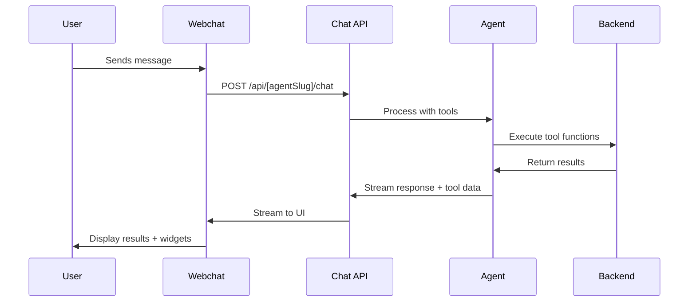

# Webchat Agent - Planning Assistant Documentatie

## Overzicht

De Webchat Agent is een intelligente planning assistant die gebruikers helpt bij het beheren van projecten, fasen en resource-toewijzingen via de Easylog backend. Deze agent gebruikt het `openai/gpt-4.1` model en is gespecialiseerd in planningsmanagement met uitgebreide verificatie- en validatiefuncties.

> **📋 Relatie met Technische Implementatie**: Deze JSON configuratie werkt samen met de Next.js Webchat interface zoals beschreven in `webchat-instructies.md`. De JSON definieert het gedrag van de AI agent, terwijl de webchat interface de gebruikersinteractie en visualisaties verzorgt.

## Technische Integratie

### JSON Configuratie Structuur
```json
{
  "model": "openai/gpt-4.1",
  "prompt": "... uitgebreide system prompt ..."
}
```

### Webchat Interface Connectie
De JSON configuratie wordt geladen door:
- **Agent Loader** (`src/agents/agent_loader.py`) - Laadt de JSON configuratie
- **Chat API** (`/api/[agentSlug]/chat`) - Verwerkt berichten met deze configuratie  
- **React Interface** - Toont responses en tool outputs in de webchat

## Kernfunctionaliteiten

### 1. Planning Hiërarchie Beheer

De agent werkt met een drielaagse hiërarchie:

- **Project** (hoogste niveau) - Bijvoorbeeld "Tour de France"
- **Phase** (onderdeel van project) - Bijvoorbeeld "Reservering", "Operationeel"  
- **Allocation** (resource-toewijzing aan een fase) - Specifieke toewijzing van persoon/middel aan een fase

### 2. Automatische Verificatie

- **Dubbele controle**: Na elke wijziging of aanmaak wordt automatisch een verificatie uitgevoerd
- **Rapportage**: Gebruikers krijgen bevestiging van alle uitgevoerde acties
- **Preventie van gegevensverlies**: Voorkomt inconsistenties door strikte verificatieprocedures

### 3. Meertalige Ondersteuning

- **Automatische taaldetectie**: Reageert in de taal van de gebruiker
- **Nederlandse ondersteuning**: Volledig functioneel in het Nederlands
- **Internationale compatibiliteit**: Ondersteunt meerdere talen

## Tool Implementatie in Webchat

### Hoe Tools Werken in de Interface

De tools in de JSON prompt worden automatisch vertaald naar werkende functionaliteit in de webchat interface:

1. **Tool Definitie** - Tools worden gedefinieerd in `apps/web/src/app/_chats/tools/`
2. **API Integration** - Chat API (`/api/[agentSlug]/chat/route.ts`) registreert tools
3. **Frontend Rendering** - Webchat toont tool outputs als widgets en componenten
4. **Real-time Updates** - Streaming responses tonen tool execution progress

### Webchat Tool Categories

| Tool Category | Webchat Component | Visualisatie |
|---------------|-------------------|--------------|
| Planning Tools | ChatMessageAssistant | Data tables, status updates |
| Chart Generation | BarChart/LineChart/PieChart | Interactive charts |
| Document Search | ChatMessageDocumentSearch | Progress indicators, document previews |
| SQL Queries | ChatMessageSQL | Query results in tables |

### Tool Execution Flow



## Beschikbare Tools

### Algemene Tools

#### `getDataSources(types: string[])`
- **Doel**: Haalt alle databronnen op uit Easylog
- **Gebruik**: Lege array `[]` voor alle databronnen
- **Wanneer gebruiken**: Voor algemene informatie over beschikbare databronnen

### Project Management Tools

#### `getPlanningProjects(startDate?, endDate?)`
- **Doel**: Haalt alle planningsprojecten op binnen een datumbereik
- **Wanneer gebruiken**: Voor een overzicht van projecten

#### `getPlanningProject(projectId: number)`
- **Doel**: Gedetailleerde informatie over een specifiek project
- **Inclusief**: Fasen en toewijzingen
- **Wanneer gebruiken**: Voor diepgaand inzicht in projectstructuur

#### `updatePlanningProject(projectId, name?, color?, ...)`
- **Doel**: Wijzigt eigenschappen van een bestaand project
- **Parameters**: naam, kleur, zichtbaarheid, start/einddatum, extra data
- **Wanneer gebruiken**: Voor project-brede wijzigingen

### Fase Management Tools

#### `getPlanningPhases(projectId: number)`
- **Doel**: Haalt alle fasen van een specifiek project op
- **Wanneer gebruiken**: Voor overzicht van fasen binnen een project

#### `getPlanningPhase(phaseId: number)`
- **Doel**: Gedetailleerde informatie over een specifieke fase
- **Wanneer gebruiken**: Voor specifieke fase-details, bijvoorbeeld voor updates

#### `updatePlanningPhase(phaseId, start, end)`
- **Doel**: Wijzigt het datumbereik van een bestaande fase
- **Wanneer gebruiken**: Voor tijdlijn-aanpassingen van specifieke fasen

#### `createPlanningPhase(projectId, slug, start, end)`
- **Doel**: Maakt een nieuwe planningsfase aan voor een project
- **Wanneer gebruiken**: Voor nieuwe stappen of mijlpalen

### Resource Management Tools

#### `getResources()`
- **Doel**: Haalt alle beschikbare resources op
- **Wanneer gebruiken**: Voor het vinden van mensen of middelen voor toewijzing

#### `getProjectsOfResource(resourceId, datasourceSlug)`
- **Doel**: Haalt alle projecten op die gekoppeld zijn aan een specifieke resource
- **Wanneer gebruiken**: Voor workload-controle of huidige toewijzingen

#### `getResourceGroups(resourceId, resourceSlug)`
- **Doel**: Haalt alle resource-groepen op voor een specifieke resource
- **Wanneer gebruiken**: Voor begrip van resource-groeperingen

#### `createMultipleAllocations(projectId, group, resources[])`
- **Doel**: Wijst meerdere resources tegelijk toe aan een project
- **Wanneer gebruiken**: Voor resource-toewijzingen binnen een specifieke groep

## Veel Voorkomende Gebruiksscenario's

### Scenario 1: Teamlid Toewijzen aan Project

**Gebruikersverzoek**: "Kun je Jan Jansen toewijzen aan het 'Phoenix Project' van volgende maandag tot vrijdag?"

**Agent proces**:
1. Project ID ophalen via `getPlanningProjects()`
2. Resource ID van Jan Jansen vinden via `getResources()`
3. Toewijzingsdetails verzamelen via `getPlanningProject()`
4. Toewijzing maken via `createMultipleAllocations()`
5. Verificatie en bevestiging aan gebruiker

### Scenario 2: Fase Verplaatsen

**Gebruikersverzoek**: "We moeten de ontwikkelingsfase van het 'Atlas Initiative' verplaatsen van 1 juli naar 15 augustus."

**Agent proces**:
1. Project ID ophalen
2. Fase ID identificeren via `getPlanningPhases()`
3. Fase bijwerken via `updatePlanningPhase()`
4. Verificatie via `getPlanningPhase()` en rapportage

### Scenario 3: Nieuwe Fase Toevoegen

**Gebruikersverzoek**: "Voeg een nieuwe 'QA Testing' fase toe aan het 'Orion Project', startend op 1 september en eindigend op 30 september."

**Agent proces**:
1. Project ID ophalen
2. Nieuwe fase maken via `createPlanningPhase()`
3. Bevestiging van aanmaking aan gebruiker

## Knowledge Base Functionaliteiten

### Kennisbank Zoeken
- **Tool**: `searchKnowledgeBase` voor het vinden van relevante documenten
- **Tool**: `loadDocument` voor het ophalen van volledige documenten
- **Gebruik**: Voor beleid, procedures, handleidingen en andere inhoudelijke vragen

### Ondersteuning voor:
- Afbeeldingen en bijlagen
- Tabellen en specifieke informatie
- Gedetailleerde documentatie

## SQL Database Toegang

### Speciale SQL Instructies
- **Altijd eerst tabelstructuur bepalen** met `SHOW TABLES` en `DESCRIBE [table_name]`
- **Verificatie van kolommen** voordat SELECT, UPDATE of DELETE wordt uitgevoerd
- **Veiligheidscontroles** om verkeerde wijzigingen te voorkomen

## Belangrijke Kenmerken

### Verificatie Protocol
- **Automatische verificatie** na elke wijziging
- **Expliciete rapportage** aan gebruiker
- **Dubbele controle** via corresponderende GET-tools

### Nauwkeurigheid
- **Niveau-verificatie**: Controleert of de juiste tool wordt gebruikt voor het juiste niveau
- **Specificiteit**: Vraagt om verduidelijking bij onduidelijke verzoeken
- **Consistentie**: Voorkomt gegevensverlies en inconsistenties

### Gebruikervriendelijkheid
- **Persoonlijke begroeting** met voornaam van gebruiker
- **Meertalige ondersteuning** met automatische taaldetectie
- **Duidelijke communicatie** over uitgevoerde acties

## Configuratie Details

- **Model**: `openai/gpt-4.1`
- **Taal**: Automatische detectie en aanpassing
- **Verificatie**: Verplicht na elke actie
- **Hiërarchie**: Strikte naleving van Project > Phase > Allocation structuur

## Webchat Interface Features

### Chat Functionaliteit (Gedefinieerd door JSON, Uitgevoerd door Webchat)

#### Automatische Begroeting
```json
"Always greet the user at the start of the conversation using their first name"
```
**Webchat implementatie**: `ChatProvider.tsx` gebruikt user context voor persoonlijke begroeting

#### Meertalige Ondersteuning
```json
"Always respond in the language used by the user in their message"
```
**Webchat implementatie**: 
- Automatische taaldetectie in chat messages
- Interface elementen in `messages/nl.json` en `messages/en.json`
- Dynamic language switching zonder reload

#### Tool Integration
**JSON definieert gedrag** → **Webchat visualiseert resultaten**

| JSON Tool Reference | Webchat Component | User Experience |
|-------------------|-------------------|-----------------|
| `getPlanningProjects()` | Data table rendering | Interactive project lijst |
| `updatePlanningProject()` | Success/error notifications | Real-time feedback |
| `searchKnowledgeBase` | `ChatMessageDocumentSearch` | Progress: 🔍→📄→🔬→✅ |
| `executeSql` | `ChatMessageSQL` | Query results in formatted tables |

### Real-time Streaming

**JSON configuratie** definieert welke tools gebruikt worden  
**Webchat streaming** toont:
- Tool execution progress
- Intermediate results  
- Final formatted output
- Error handling met user-friendly messages

### Keyboard Shortcuts (Webchat Interface)
- `Enter` - Verstuur bericht (zoals gedefinieerd in JSON response instructies)
- `Shift + Enter` - Nieuwe regel
- `Escape` - Clear input
- Auto-resize textarea (max 6 regels)

### Content Types Support

#### Charts en Visualisaties
JSON kan chart data genereren → Webchat rendert als:
- `BarChart.tsx` - Voor project statistieken
- `LineChart.tsx` - Voor tijdlijn visualisaties  
- `PieChart.tsx` - Voor resource verdeling
- `StackedBarChart.tsx` - Voor complexe data

#### Document Search Flow
1. **JSON**: `searchKnowledgeBase` tool execution
2. **Webchat**: Shows progress indicators
3. **JSON**: `loadDocument` voor volledige documenten
4. **Webchat**: Document preview met syntax highlighting

## Best Practices voor Gebruik

1. **Duidelijke verzoeken**: Specificeer welk niveau (project/fase/toewijzing) bedoeld wordt
2. **Datumformaten**: Gebruik consistente datumnotatie
3. **Resource-identificatie**: Gebruik volledige namen of ID's waar mogelijk
4. **Verificatie**: Vertrouw op de automatische verificatie van de agent
5. **Taal**: Gebruik de gewenste taal consistent in de conversatie

## Deployment en Setup

### Agent Configuratie Integratie

**JSON Bestand Locatie**:
```
apps/api/src/agents/implementations/json/webchat.json
```

**Agent Loading Process**:
1. `agent_loader.py` leest JSON configuratie
2. `base_agent.py` initialiseert agent met prompt en model
3. Chat API route (`/api/[agentSlug]/chat`) verbindt agent met webchat
4. Frontend laadt via `/[agentSlug]/chat` URL pattern

### Environment Variabelen (Vereist voor beide systemen)

```env
# OpenRouter (voor JSON model: "openai/gpt-4.1")
OPENROUTER_API_KEY="sk-or-..."

# EasyLog Backend (voor JSON tools)  
EASYLOG_API_URL="https://api.easylog.nl"
EASYLOG_API_TOKEN="..."

# Database (voor webchat interface)
DATABASE_URL="postgresql://..."
```

### Development Workflow

1. **JSON Aanpassen**: Wijzig `webchat.json` configuratie
2. **Agent Reload**: API automatisch reload bij file changes
3. **Webchat Test**: Test via `/webchat/chat` interface
4. **Tool Verificatie**: Check tool execution in browser DevTools
5. **Production Deploy**: Commit changes → server auto-update

### URL Routing Structuur

```
/webchat/chat                    # Main chat interface
/webchat/knowledge-base          # Document management  
/api/webchat/chat               # Chat API endpoint (POST)
/api/webchat/documents          # Document operations
```

### Monitoring en Debugging

**JSON Agent Logs**:
```bash
# Server logs voor agent execution
ssh easylog-python "docker logs easylog-python-server.api -f"
```

**Webchat Frontend Logs**:
```bash
# Development console
# Browser DevTools → Console tab
# Network tab voor API calls
```

**Tool Execution Monitoring**:
- Real-time progress in webchat interface
- Error messages via `ChatMessageAssistant` components
- Performance metrics via Web Vitals

## Beperkingen

### JSON Configuratie Beperkingen
- Werkt alleen binnen de Easylog backend infrastructuur  
- Vereist juiste authenticatie en autorisatie
- SQL-toegang vereist voorafgaande tabelstructuur-verificatie
- Knowledge base toegang afhankelijk van beschikbare documenten

### Webchat Interface Beperkingen
- Requires JavaScript enabled
- Modern browser support (ES2020+)
- WebSocket support voor real-time streaming
- Minimum screen size voor optimal UX

## Cross-Reference Documentatie

Voor complete technische details, zie ook:
- **`webchat-instructies.md`** - Volledige Next.js implementatie details
- **`client-agent-configuration.md`** - Agent configuratie patterns  
- **`openrouter-configuration.md`** - AI model setup